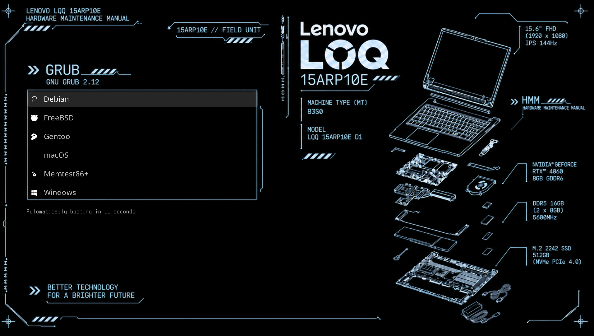

# LOQ 15ARP10E GRUB theme

A GRUB theme for the Lenovo LOQ 15ARP10E, tuned for its **1920x1080 (FHD)** display.



## Credits

This theme is based on [AmberIsFrozen/thinkpad-x1-gen13-grub-theme](https://github.com/AmberIsFrozen/thinkpad-x1-gen13-grub-theme), which in turn is derived from [AdisonCavani/distro-grub-themes](https://github.com/AdisonCavani/distro-grub-themes).

## Get started

### Installation

1. Download the content of this repository (via GitHub's download button or by cloning it).
2. Copy the `loq-15arp10e` directory to `/boot/grub/themes`.
3. Edit the GRUB config file (usually `/etc/default/grub`) and add:
   ```
   GRUB_THEME="/boot/grub/themes/loq-15arp10e/theme.txt"
   ```
4. Regenerate your GRUB config (`grub-mkconfig -o /boot/grub/grub.cfg` on Arch/Fedora, `update-grub` on Ubuntu/Debian-based distros).

For more detailed instructions, see [k1ng.dev/distro-grub-themes installation](https://k1ng.dev/distro-grub-themes/installation#manual-installation).

### Customization

This theme is designed specifically for the LOQ 15ARP10E, so the scope and variants offered are intentionally narrow.

GRUB themes are simple to customize, though — feel free to make it your own.

#### Boot option icons

The icons are unchanged from [distro-grub-themes](https://github.com/AdisonCavani/distro-grub-themes). To change an icon, edit the matching PNG in `loq-15arp10e/icons`.

#### Background

The background image is `loq-15arp10e/background.png`. Replace it to personalize the theme; the boot entries and auto-boot prompt are drawn separately by GRUB, so they stay put.

The background is intentionally dimmed, since there's no brightness control at boot. Adjust the source image's opacity if it's too bright or too dark.

## License

This project is licensed under the [GNU General Public License v3.0](https://www.gnu.org/licenses/gpl-3.0.html).
